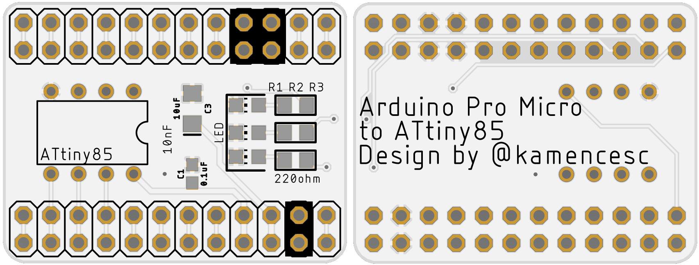

# Untested

# Arduino Pro Micro ATtiny85 Programmer
Board to program ATtiny85 using an Arduino Pro Micro.

It fits on two diferent size of Pro Micro (you can differenciate them by the USB, Mini USB for the big one and Micro USB for the little one).

Project comes from [Programming ATtiny85 with Arduino Uno ](https://create.arduino.cc/projecthub/arjun/programming-attiny85-with-arduino-uno-afb829) and it's adapted to Arduino Pro Micro, maybe needs some code modification (todo).

There are *OPTIONAL* LEDs as you can see in [Utiliza tu placa Arduino como programador para ATtiny](https://fabricadigital.org/tutoriales/utiliza-tu-placa-arduino-como-programador-para-attiny/).

